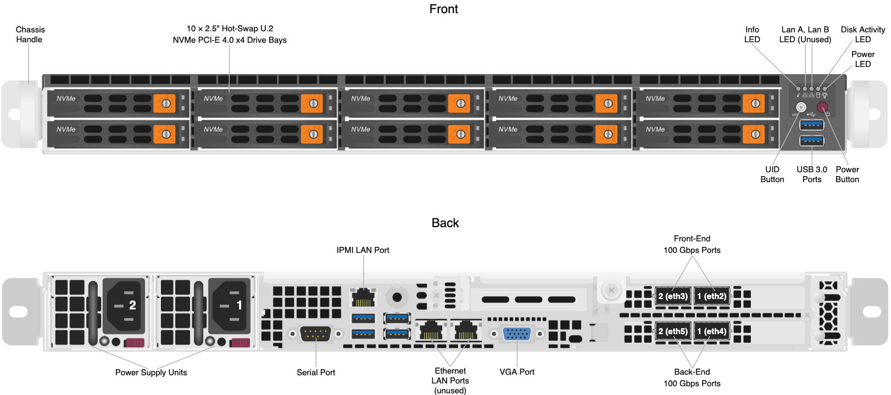
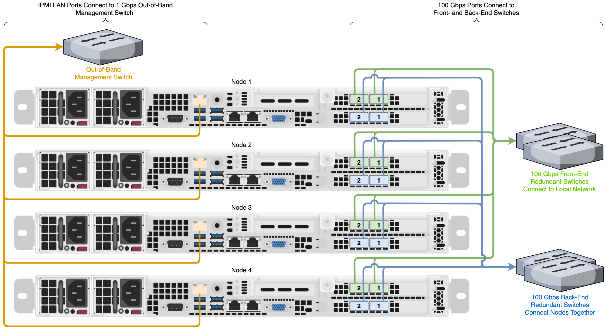
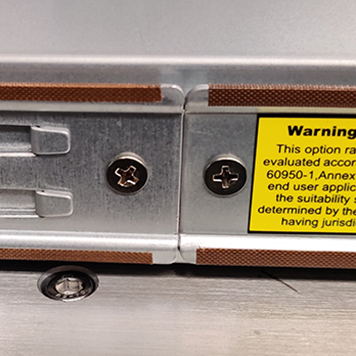
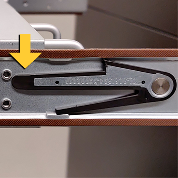

# Qumulo on Supermicro Getting Started Guide
Welcome to Qumulo on Supermicro. This guide is intended for system administrators, professional service providers, and colleagues in your organization who are responsible for installing and configuring server hardware.

This guide includes quick-reference diagrams for Supermicro All-NVMe nodes and cluster architecture diagrams, an explanation of node LEDs, and a diagram of drive slots and PCIe mapping. The guide walks you through racking and wiring your nodes, installing Qumulo Core on your nodes, and creating a Qumulo cluster. The [Appendix](#appendix) contains the currently known behavior of Supermicro nodes and technical specifications.

For more information about administering your cluster, see the [Qumulo Care](https://care.qumulo.com/hc/en-us) portal. If you have any questions, you can [open a case](https://care.qumulo.com/hc/en-us/requests/new), email us at [care@qumulo.com](mailto:care@qumulo.com), or contact us in your private channel in the [qumulocare](https://qumulocare.slack.com/) Slack workspace.


# Quick Reference
This section contains quick-reference diagrams for the front and back of your Supermicro node, an architecture diagram of an example four-node cluster, an explanation of node LEDs, and a diagram of drive slots and PCIe mapping.

## Front and Back Node Diagrams


## Four-Node Cluster Architecture Diagram


## Node LEDs
On the front, right side of your Supermicro node, there are five LEDs.

| Label         | Color       | Normal Behavior                 |
| ------------- | ----------- | ------------------------------- |
| Info          | 🔴 (red)    | Blinks if power cable unplugged |
| Lan A         | (unused)    | Off                             |
| Lan B         | (unused)    | Off                             |
| Disk Activity | 🟡 (yellow) | On or blinking                  |
| Power         | 🟢 (green)  | On                              |

**Note:** During normal operation, the **Lan B** LED might appear to be lit slightly when the **Disk Activity** LED is on.

On the back of your Supermicro node, LAN LEDs are located behind the vent holes on the NIC. Each port has one light. Network traffic *doesn't* affect the speed of the light's blinking.

| Color      | Status             | Normal Behavior  |
| ---------- | ------------------ | ---------------- |
| &#8212;    | Off                | No link          |
| 🟢 (green) | On or blinking     | Link established |

## Drive Slot Mapping
A Supermicro node contains slots for 10 drives and one boot drive (in an iternal M.2 slot). The following is the mapping for the drives.

<table>
<thead>
  <tr>
    <th>Row</th>
    <th colspan="5">Drive Slots</th>
  </tr>
</thead>
<tbody>
  <tr>
    <td>Top</td>
    <td><code>1</code></td>
    <td><code>2</code></td>
    <td><code>3</code></td>
    <td><code>4</code></td>
    <td><code>5</code></td>
  </tr>
  <tr>
    <td>Bottom</td>
    <td><code>6</code></td>
    <td><code>7</code></td>
    <td><code>8</code></td>
    <td><code>9</code></td>
    <td><code>10</code></td>
  </tr>
</tbody>
</table>


# Step 1: Racking Your Nodes
**Tip:** You can use the following instructions to add new nodes after your initial cluster deployment.

This section describes how to use the outside and inside rails of your Supermicro node and how to rack your nodes in your data center.

## To Attach the Outer and Inner Rails
**Note:** Because the left and right rails of your Supermicro nodes are identical, the words **FRONT** and **BACK** might appear upside down.

* Each *outer rail* comes as two connected pieces and attaches to your server rack.
* Each *inner rail* comes as two separate pieces and attaches to the node chassis.

1. Adjust the outer rails to the length of your server rack.
1. Line up the edge of the outer rail between the rack unit (RU) markers, insert the tabs on the edge of the rail into the mounting holes, and push the rail into the rack until the quick-release snaps into place. This process is the same for the front and back of your rack.

   

1. Snap the inner rails to the chassis and secure them using two screws on each side, near the middle of the chassis.

   **Note:** First attach the front inner rails, then the back inner rails.

   

## To Insert the Chassis
1. Align the outer and inner rails and insert the chassis into the server rack.
1. Attach the chassis to the rack using one screw on each side, on the front of the chassis.

## To Remove the Chassis
1. Disconnect any cables from the chassis. 
1. Remove one screw from each side of the front of the chassis.
1. Pull the chassis out from the server rack partially. When the first set of black snaps appears, pinch the long piece of the snap towards the short one (up on one side, down on the other).

   

1. Continue to pull the chassis from the server rack. When the second set of black snaps appears, pinch the long piece of each snap towards the short one (up on one side, down on the other) and remove the chassis completely.


# Step 2: Wiring Your Nodes
This section describes how to wire the remote access, network, and power ports of your Supermicro node.

**Note:** The two Ethernet ports on the back of your node (to the right of the USB ports) are unused.

## Connecting the Out-of-Band Management (IPMI) Port
The dedicated out-of-band management port allows functionality such as remote display, control, and power (similar to HPE iLO). The port uses the Intelligent Platform Management Interface (IPMI) protocol. First, connect the IPMI port first on the back of your node (above the USB ports).

## Connecting the 100 Gbps Ports
After you connect the IPMI port, connect your front-end and back-end 100 Gbps ports (compatible with QSFP28 and QSFP56). There are four 100 Gbps ports on the back of your node. To maximize redundancy, split interfaces across subnets by connecting each port to a different switch.

| Port Location         | Port Type  | Purpose                     |
| --------------------- | ---------- | --------------------------- |
| Top row (`2`, `1`)    | Front end  | Communication with clients  |
| Bottom row (`2`, `1`) | Back end   | Communication between nodes |

## Connecting the Power
**Important:** Make sure that the voltages for both power supply units (PSUs) are the same (for example, both at 115 V or both at 208 V).

After you connect your 100 Gbps ports, connect power to the node. There are two power sockets on the back of your node. To maximize redundancy, connect each PSU to a separate power supply or power distribution unit (PDU).

# Step 3: Installing Qumulo Core on Your Nodes
This section describes how to install Qumulo Core on your Supermicro nodes.

## Creating a Qumulo Core USB Drive Installer
To perform a clean installation of Qumulo Core on your node, you must create a Qumulo Core USB Drive Installer. To begin, you must have a USB drive (4 GB minimum) and a Qumulo Core USB installer image from the [Qumulo Care Team](https://care.qumulo.com/hc/en-us/articles/115008409408-Contact-Qumulo-Care-).

### To Create a USB Drive Installer on Mac OS
1. Open Terminal and log in as `root` by using the `sudo -s` command.

1. Insert your USB drive and then find its disk label by using the `diskutil list` command. In the following example, the USB drive's device label is `disk2`.

   ```Bash
   /dev/disk2 (external, physical):
      #:                       TYPE NAME                    SIZE       IDENTIFIER
      0:             Windows_FAT_32 MY_USB_DRIVE            *32.0 GB    disk2
   ```

1. To unmount the USB drive, use your USB drive's device label, for example:

   ```Bash
   diskutil unmountDisk /dev/disk2
   ```

1. To write the Qumulo Core USB installer image to your USB drive, specify the path to your image file and the USB drive's device label, for example:

   ```Bash
   dd if=/path-to-image-file/ of=/dev/rdisk2 bs=2m
   ```

   **Note:** If you encounter an **Operation not permitted** error, navigate to **System Preferences > Security & Privacy**, on the **Privacy** tab grant **Full Disk Access** to Terminal, restart Terminal, and then try the command again. When finished, remove **Full Disk Access** from Terminal.

1. Eject your Qumulo Core USB Drive Installer, for example:

   ```Bash
   diskutil eject disk2
   ```

### To Create a USB Drive Installer on Windows
To create a USB Drive Installer on Windows, you must use a third-party application such as [Rufus](https://rufus.ie/). We recommend Rufus because it can detect mny USB storage devices (rather than only Windows-compatible ones).

**Important:**
* We don't recommend using other tools (such as Win32 Disk Imager) because they might encounter errors when unable to recognize the USB drive after writing data to it.
* When the operation concludes, you might not be able to view the contents of the USB drive on Windows because the drive will be formatted using a different file system.

1. Press the **Power** button.

1. Insert your USB drive and run Rufus.

1. Under **Drive Properties**, select a device and the path to the Qumulo Core USB installer image.

1. For **Partition scheme**, select **MBR** and for **Target System**, select **BIOS or UEFI**.
   
1. Under **Format Options**, ensure that the **File system** is **FAT32 (Default)** and **Cluster size** is **4096 bytes (Default)**.

1. Click **Start**.

1. If prompted to download a new version of `GRUB` or `vesamenu.c32`, click **No**.

1. When the **ISOHybrid image detected** dialog box appears, click **Write in DD Image mode** and then click **OK**.

1. To confirm the operation, destroy all data on the USB drive, and image the drive click **OK**.

## Running the Field Verification Tool (FVT) and Installing Qumulo Core
The Field Verification Tool (FVT) checks your Supermicro node, prepares it for Qumulo Core, and installs Qumulo Core.

**Caution:** The FVT erases all data from the node. You must back up any live data on the node before you run the FVT.

1. When the node powers on and begins to boot, on the **Supermicro** screen, press **F11**. The following message appears:

   ```Bash
   DXE--BIOS PCI Bus Enumeration
   Invoking Boot Menu
   ```

1. On the **Please select boot device:** screen, select your USB drive (usually labelled with `UEFI OS`) and boot into it.

   The FVT starts automatically and the following message appears.

   ```Bash
   RELEASE: Qumulo Core X.X.X

   Please choose from the following options:
   [1] Factory reset (DESTROYS ALL DATA)
   [*] Perform maintenance
   >
   ```

1. Enter `1`.

   The following message appears.

   ```Bash
   You are running a FACTORY RESET. This will wipe all data on BOTH the boot drive AND the data drives.
   This operation is going to DESTROY ALL DATA on the cluster, in order to proceed you must type "DESTROY ALL DATA" ("no" cancels):
   ```

1. To continue, enter `DESTROY ALL DATA`.

   The following message appears.

   ```Bash
   Running FVT. Please wait...
   ```

1. When the FVT finishes, the following message appears.

   ```Bash
   FVT passed!

   Wiping boot drive.
   Writing OS image.
   Writing container image.
   Wiping data drives.
   Installation successful. Ctrl-C to cancel reboot.
   ```

   You can now install the Qumulo Core software image.

### Troubleshooting FVT Fail Cases
If the FVT encounters an issue, the `FTV failed!` message and an explanation appears.

FVT fail cases divide into *fixable* and *non-fixable* issues.

#### Fixable Issues
The following is an example of a fixable issue. To let FVT try fix the issue, enter `1`.

   ```Bash
   FTV failed!

   The following issues were detected:
   check_bmc_version: FAIL: We require a minimum BMC version of 1.00.34. You have 1.00.33.
   FIX: Run the FVT flash command.

   [1] Run FVT Flash. This will try to fix issues then reboot. Please take caution as this MAY DESTROY EXISTING DATA.
   [2] Start a rescue shell
   ```

Depending on your node hardware and installation scenario, FVT might be able to correct issues such as the following automatically:

  * BIOS configuration
  * Drive firmware
  * NIC mode
  * Boot order

#### Non-Fixable Issues
The following is an example of a non-fixable issue. To fix the issue, contact the [Qumulo Care Team](https://care.qumulo.com/hc/en-us/articles/115008409408-Contact-Qumulo-Care-).

   ```Bash
   FTV failed!

   The following issues were detected:
check_cpu_model: FAIL: We require one of: AMD EPYC 7402P 24-Core Processor. You have Qumulo Grumpquat 4000 Processor.
   FIX: Contact Qumulo Care.
   Not fixable issues were detected.

   [1] Copy logs to USB installer.
   [2] Start a rescue shell
   ```

### Performing the Part Replacement Procedure Using the FVT
When you replace a component of your node (such as the motherboard or an NIC card), you must ensure that the firmware version and configuration are correct for your new components. To do this, you must perform the part replacement procedure using the FVT.

**Note:** Before you replace the motherboard, you must request a new DCMS license key from Supermicro and apply it before you run the FVT. (The license key uses the BMC MAC address which changes with the motherboard.) For more information, see [Data Center Management Suite (DCMS) Licenses](#data-center-management-suite-dcms-licenses).

1. [Boot using the latest version of the Qumulo Core USB Drive Installer](#running-the-field-verification-tool-fvt-and-installing-qumulo-core).

1. When prompted, enter `*` to select `[*] Perform maintenance`.

   The following message appears.

   ```Bash
   Please choose from the following options:
   [1] Boot drive reset (DESTROYS BOOT DRIVE CONTENTS)
   [2] Perform automatic repair after part replacement (non-destructive)
   [3] Drop to a shell to perform manual maintenance
   >
   ```

1. Enter `2`.

   The part replacement procedure runs and the following message appears.

   ```Bash
   Running FVT. Please wait...
   100%|▮▮▮▮▮▮▮▮▮▮▮▮▮▮▮▮▮▮▮▮▮▮▮▮▮▮▮▮▮▮▮▮▮▮▮▮▮▮▮▮▮▮▮▮▮▮▮▮▮▮▮▮▮▮▮▮▮▮▮▮▮▮▮▮▮▮▮▮▮▮▮▮▮▮▮▮▮▮▮▮▮▮▮▮▮▮▮▮▮▮▮▮▮▮▮▮▮▮▮▮| 13/13 [00:26<00:00, 2.01s/check]
   FVT passed!

   No issues were detected, the system is ready to utilize the replaced parts.
   
   Actions:
   [1] Shut down the system. After the system powers off, you may remove the USB stick and then power on the system to boot into the product.
   [2] Start a rescue shell
   >
   ```

**Note:** In some cases, after the part replacement procedure, the message `FIX: Run the FVT flash command.` appears. Enter `1` as you would for a [fixable issue](#fixable-issues) to reboot the node and then repeat the part replacement procedure.


# Step 4: Creating a Qumulo Cluster
This section describes how to configure your Supermicro nodes to form a Qumulo cluster.

## To Create the Cluster
1. Power on four or more nodes that run the same version of Qumulo Core.
1. Review the End User Agreement and when ready click **I agree to the End User Agreement**.
1. In the **1. Set up cluster** section, do the following:

   a. Enter a **Cluster name**.
   
   b. Click the checkmark next to each node to add to your cluster. The total cluster capacity appears at the bottom of the page.
   
   c. Check that your nodes are ordered according to their physical arrangement in the server rack. You can check your nodes' order in the following ways:

   * Power on the nodes one at a time and watch the nodes populate this page.
   * Retrieve the MAC address for each node and compare the addresses to those listed on this page.

   If not all nodes appear on this page, check the nodes' networking configuration.

1. Confirm your cluster protection level (how many drive failures Qumulo Core will protect the cluster against). Depending on your cluster size and node types, two-drive or three-drive protection is selected. If **Customize Protection Level** is available, in the **2. Confirm cluster protection level** section, you can choose two-drive protection or three-drive protection.

   **Important:**
   * You can choose your cluster protection level only during cluster creation. You can't change this setting later.
   * Choosing protection for more drives decreases your cluster capacity.
   * To enable multi-node protection, you must create your cluster using the CLI.

1. In the **3. Create a password for your admin account** section, set the password for your administrative account.

# Appendix
The following appendix contains the currently known behavior of Supermicro nodes and the technical specifications for Supermicro 153 TB, 76 TB, and 30 TB nodes.

## Known Behavior
The following is the currently known behavior for Supermicro nodes.

### Firmware
Don't update your node firmware unless a Qumulo representative instructs you to perform an update.

### Data Center Management Suite (DCMS) Licenses
If a DCMS license isn't installed on a Supermicro node, the Field Verification Tool (FVT) fails, preventing you from installing Qumulo Core. A DCMS license from Supermicro is required for Qumulo Core to work correctly.

## Supermicro Technical Specifications
<table cellspacing="0" cellpadding="0">
<thead>
<tr>
<th><strong>Specification</strong></th>
<th><strong>Supermicro All-NVMe 153 TB</strong></th>
<th><strong>Supermicro All-NVMe 76 TB</strong></th>
<th><strong>Supermicro All-NVMe 30 TB</strong></th>
</tr>
</thead>
<tbody>
<tr>
<td><strong>Connectivity Ports (NIC)</strong></td>
<td colspan="3" style="text-align: center;">4 &#215; 100 GbE (2 x Mellanox CX-6 NICs)</td>
</tr>
<tr>
<td><strong>Management Ports (BMC)</strong></td>
<td colspan="3" style="text-align: center;">1 &#215; 1 GbE Base-T (RJ45)</td>
</tr>
<tr>
<td><strong>Solid State Storage Media</strong></td>
<td>
<div>10 &#215; 15.36 TB NVMe drives (Micron 9300 or WDC SN840)</div>
</td>
<td>
<div>10 &#215; 7.68 TB NVMe drives (Micron 7300 or WDC SN640)</div>
</td>
<td>
<div>8 &#215; 3.84 TB NVMe drives (Micron 7300 or WDC SN640)</div>
</td>
</tr>
<tr>
<td><strong>Boot Drive</strong></td>
<td colspan="3" style="text-align: center;">1 TB M.2 NVMe drive (Intel P4511 1 TB)</td>
</tr>
<tr>
<td><strong>CPU</strong></td>
<td colspan="3" style="text-align: center;">AMD EPYC 7402P 24-Core Processor</td>
</tr>
<tr>
<td><strong>Memory</strong></td>
<td colspan="3" style="text-align: center;">128 GB (16 GB &#215; 8)</td>
</tr>
<tr>
<td><strong>Power Supply</strong></td>
<td colspan="3" style="text-align: center;">2 &#215; 750 W Power Supplies</td>
</tr>
<tr>
<td><strong>Dimensions (H &#215; W &#215; D)</strong></td>
<td colspan="3" style="text-align: center;">1.7" &#215; 17.2" &#215; 23.5" (43 mm &#215; 437 mm &#215; 597 mm)</td>
</tr>
<tr>
<td><strong>Weight</strong></td>
<td colspan="3" style="text-align: center;">46 lbs (20.9 kg)</td>
</tr>
<tr>
<td><strong>Power Requirements</strong></td>
<td colspan="3" style="text-align: center;">100&ndash;240 V, 50/60Hz</td>
</tr>
<tr>
<td><strong>Typical Power Consumption</strong></td>
<td>265 W</td>
<td>230 W</td>
<td>230 W</td>
</tr>
<tr>
<td><strong>Typical Thermal Rating</strong></td>
<td>904 BTU/hr</td>
<td>785 BTU/hr</td>
<td>785 BTU/hr</td>
</tr>
<tr>
<td>
<div><strong>Maximum Power Consumption</strong></div>
</td>
<td>460 W</td>
<td>415 W</td>
<td>384 W</td>
</tr>
<tr>
<td><strong>Maximum Thermal Rating</strong></td>
<td>1569 BTU/hr</td>
<td>1416 BTU/hr</td>
<td>1310 BTU/hr</td>
</tr>
<tr>
<td><strong>Operating Temperature</strong></td>
<td colspan="3" style="text-align: center;">50&deg;F&ndash;95&deg;F(10&deg;C&ndash;35&deg;C)</td>
</tr>
<tr>
<td><strong>Non-Operating Temperature</strong></td>
<td colspan="3" style="text-align: center;">40&deg;F&ndash;158&deg;F(-40&deg;C&ndash;70&deg;C)</td>
</tr>
<tr>
<td><strong>Operating Relative Humidity</strong></td>
<td colspan="3" style="text-align: center;">8%&ndash;90% (non-condensing)</td>
</tr>
<tr>
<td>
<div><strong>Non-Operating Relative Humidity</strong></div>
</td>
<td colspan="3" style="text-align: center;">5%&ndash;95% (non-condensing)</td>
</tr>
</tbody>
</table>
